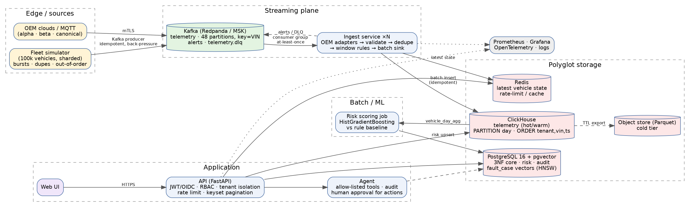

# FleetPulse - predictive maintenance for connected fleets

**Problem:** fleet managers learn about a breakdown when it happens. FleetPulse ingests a 100k-vehicle telemetry stream, flags
dangerous conditions within seconds, and ranks every vehicle by its probability of breaking down in the next 7 days
(model vs the rule baseline in use today), with a guarded agent and a tenant-isolated, audited API.



## Quick start
```bash
cp .env.example .env            # set secrets
docker compose up --build       # redpanda, clickhouse, postgres+pgvector, redis, ingest x4, api, simulator, prometheus, grafana
open http://localhost:8000/ui   # sign in with a dev token (ENV=dev only)
VEHICLES=10000 docker compose up   # laptop-sized
```
No Docker? The whole domain, API and UI run on in-memory adapters: `pip install -r requirements-dev.txt && uvicorn fleetpulse.api.main:app` then open `/ui`.

## Test commands
| What | Command |
|---|---|
| Unit + API + security + simulator/ML (62 tests), coverage gate 80% | `make cov` |
| BDD acceptance (4 scenarios) | `make bdd` |
| Real PostgreSQL 16 EXPLAIN ANALYZE before/after (100k vehicles, 1.5M alerts) | `make explain` |
| Micro-benchmarks (simulator, processor, API) | `make bench` |
| Integration with real Kafka/ClickHouse (Docker) | `pytest tests/integration` |
| API load / soak (k6) | `make load` / `k6 run -e SOAK=1 ...` |
| Chaos: kill broker + ingest pod | `make chaos` |

## Layout
`fleetpulse/core` domain (VIN, DTC, schema, OEM adapters, sketches, windows, trips, geo) - no framework imports ·
`fleetpulse/ingest` application service + ports + adapters · `fleetpulse/api` FastAPI, auth, agent, audit ·
`fleetpulse/sim` simulators · `fleetpulse/ml` model + case library · `db/` DDL, optimisations, EXPLAIN harness ·
`infra/` Helm, Terraform, Prometheus · `docs/` ADRs, STRIDE, query plans, benchmarks · `tests/`, `features/`, `loadtest/`

## Environment variables
See `.env.example` (ENV, JWT_SECRET, JWKS_URL, DATABASE_URL, CLICKHOUSE_HOST, REDIS_URL, KAFKA_BROKERS, REPO, VEHICLES, RATE_PER_S, RATE_BURST).

